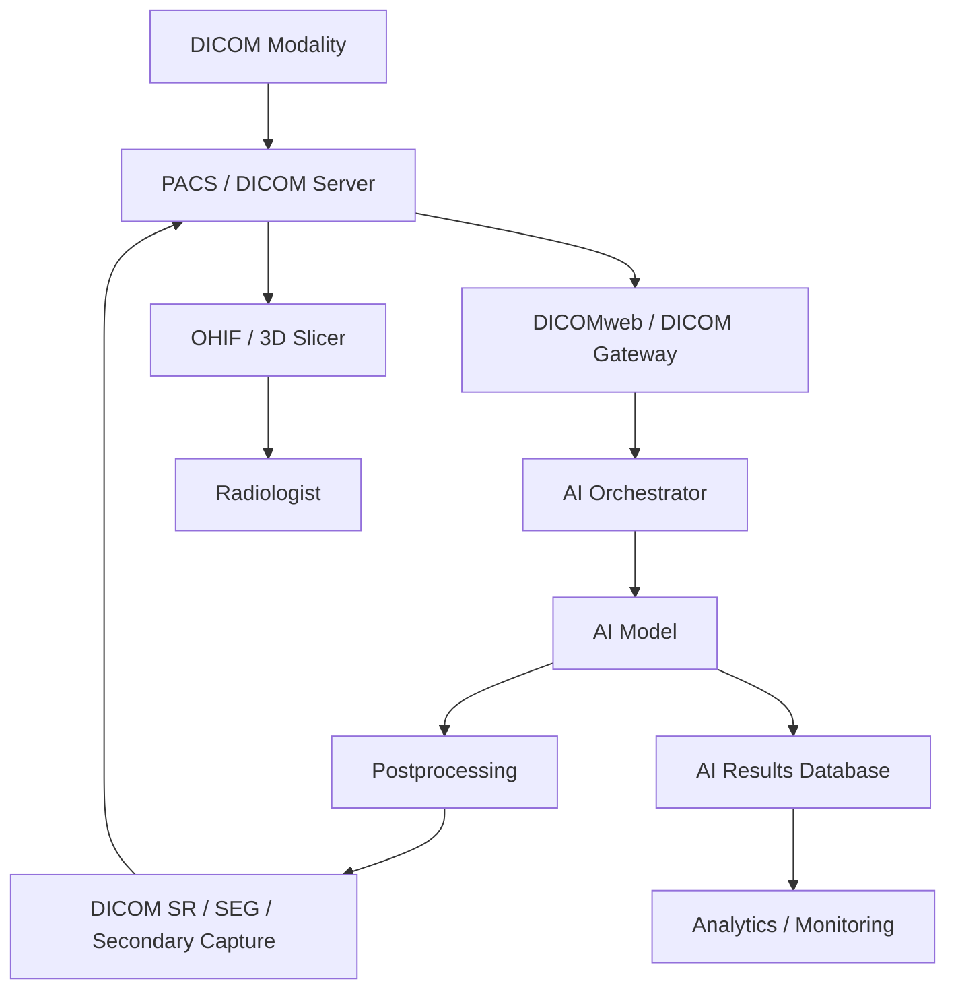
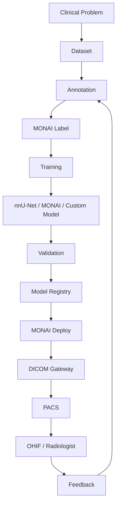

# Awesome-Radiology-AI-Platform

# 🩻 Top Radiology AI Platforms & Open-Source Radiology AI


> A curated list of **Radiology AI platforms, medical imaging AI companies, clinical AI software, open-source medical imaging frameworks, segmentation models, DICOM infrastructure, annotation tools and self-hostable radiology AI software**.


Radiology AI spans much more than image classification. Modern platforms can support:


* Detection

* Classification

* Segmentation

* Quantification

* Triage

* Workflow prioritization

* Image reconstruction

* Image enhancement

* Radiation-dose reduction

* Structured reporting

* Clinical decision support

* Follow-up comparison

* Oncology imaging

* Cardiac imaging

* Neuroimaging

* Chest imaging

* Musculoskeletal imaging

* Mammography

* CT / MRI / X-ray / ultrasound

* AI model deployment

* PACS integration

* DICOM / DICOMweb


This repository focuses primarily on **open-source and self-hostable software** that can be used to build radiology AI systems, while keeping commercial platforms such as **Aidoc, Qure.ai, Lunit, Oxipit, Subtle Medical, Arterys, Gleamer, Rad AI and Annalise.ai** in a separate SaaS/Commercial section.


> **Important:** Open-source radiology software is generally a collection of frameworks, models and infrastructure rather than a drop-in replacement for a regulated clinical AI platform. Clinical deployment requires appropriate validation, regulatory compliance, cybersecurity, workflow integration and, where applicable, medical-device authorization.


---


## 📑 Table of Contents


* [☁️ SaaS/Hosted & Commercial Platforms](#️-saashosted--commercial-platforms)

* [🌍 Open-Source](#-open-source)

* [🧠 Open-Source Radiology AI Frameworks](#-open-source-radiology-ai-frameworks)

* [🩻 Open-Source Medical Imaging AI](#-open-source-medical-imaging-ai)

* [🎯 Open-Source Segmentation](#-open-source-segmentation)

* [🔎 Open-Source Detection & Classification](#-open-source-detection--classification)

* [🧬 Open-Source Foundation Models for Medical Imaging](#-open-source-foundation-models-for-medical-imaging)

* [🏷️ Open-Source Annotation & Active Learning](#️-open-source-annotation--active-learning)

* [🚀 Open-Source Clinical AI Deployment](#-open-source-clinical-ai-deployment)

* [🖥️ Open-Source DICOM Viewers](#️-open-source-dicom-viewers)

* [🏥 Open-Source PACS & DICOM Infrastructure](#-open-source-pacs--dicom-infrastructure)

* [🔌 Open-Source DICOM Libraries](#-open-source-dicom-libraries)

* [🧮 Open-Source Medical Image Processing](#-open-source-medical-image-processing)

* [📐 Open-Source Registration & Image Analysis](#-open-source-registration--image-analysis)

* [📊 Open-Source Radiomics](#-open-source-radiomics)

* [🧪 Open-Source Medical Imaging Datasets](#-open-source-medical-imaging-datasets)

* [🧩 Commercial Platform → Open-Source Equivalent](#-commercial-platform--open-source-equivalent)

* [🏗️ Radiology AI Architecture](#️-radiology-ai-architecture)

* [🔄 Open-Source Radiology AI Pipeline](#-open-source-radiology-ai-pipeline)

* [🏥 PACS → AI → PACS Architecture](#-pacs--ai--pacs-architecture)

* [⚖️ Commercial vs Open-Source](#️-commercial-vs-open-source)

* [🚀 Recommended Open-Source Stacks](#-recommended-open-source-stacks)

* [📊 Radiology AI Technology Comparison](#-radiology-ai-technology-comparison)

* [🎯 Recommended Projects by Use Case](#-recommended-projects-by-use-case)

* [🏢 Building an Aidoc Alternative](#-building-an-aidoc-alternative)

* [🩻 Building an Open-Source Radiology AI Platform](#-building-an-open-source-radiology-ai-platform)

* [🌐 Open-Source Radiology AI Landscape](#-open-source-radiology-ai-landscape)

* [🧠 Why Open-Source Radiology AI Matters](#-why-open-source-radiology-ai-matters)

* [🤝 Contributing](#-contributing)

* [⚠️ Disclaimer](#️-disclaimer)


---


# ☁️ SaaS/Hosted & Commercial Platforms


Commercial radiology AI companies generally package models, workflow integration, clinical validation and deployment infrastructure into a healthcare product.


| Platform | Company | Primary Focus | Typical Capabilities | Pricing (Starting Tier / Standard Rate) | Free Tier Limits / Free Trial Limits |
| --- | --- | --- | --- | --- | --- |
| [Aidoc](https://www.aidoc.com/) | Aidoc | Clinical radiology AI | Detection, triage, workflow prioritization and multiple imaging findings | Starts at ~$6.00/scan/algorithm (marketplace) or ~$50,000/site/year baseline enterprise contract | No free-for-ever tier; clinical pilot trials granted on request (typically 30–90 day hospital site pilot) |
| [Qure.ai](https://qure.ai/) | Qure.ai | Medical imaging AI | Chest X-ray, CT, TB, stroke and other imaging applications | Starts at ~$1.50–$3.50/scan (₹120–₹300/scan pay-per-study) or ~$15,000/year annual SaaS tier | No free-for-ever tier; free trial limited to 30-day clinical POC / institutional evaluation pilot |
| [Lunit](https://www.lunit.io/) | Lunit | Imaging AI | Chest X-ray and oncology / mammography AI | Starts at ~$2.00–$5.00/scan volume tier or ~$20,000/year baseline clinical license | No free-for-ever tier; free trial limited to 14-day web demo evaluation / 30-day institutional pilot |
| [Oxipit](https://www.oxipit.com/) | Oxipit | Autonomous radiology AI | Chest X-ray analysis and automated reporting workflows | Starts at ~$1.00–$3.00/CXR study or ~$12,000/year hospital subscription | No free-for-ever tier; offers free one-time retrospective quality audit pilot on up to 1,000 CXR studies |
| [Subtle Medical](https://subtlemedical.com/) | Subtle Medical | Image enhancement | MRI/PET enhancement, contrast and scan optimization | Starts at ~$1,500/month/scanner or ~$18,000/year per imaging unit | No free-for-ever tier; offers a 90-day free trial / clinical trial license for SubtlePET/SubtleMR |
| [Arterys](https://www.arterys.com/) | Arterys (Tempus) | Cloud medical imaging AI | Cardiac, oncology and imaging analysis | Starts at ~$3,000/month (~$36,000/year) clinical departmental tier | No free-for-ever tier; offers 30-day proof-of-concept institutional evaluation trial |
| [Gleamer](https://www.gleamer.ai/) | Gleamer | Musculoskeletal AI | X-ray detection and radiology assistance | Starts at ~$2.50/bone X-ray study or ~$15,000/year clinic subscription | No free-for-ever tier; offers a 30-day clinical workflow pilot trial for radiology departments |
| [Rad AI](https://www.radai.com/) | Rad AI | Radiology workflow | Reporting, workflow optimization and generative AI | Starts at ~$150/radiologist/month (~$1,800/seat/year) for reporting tools | No free-for-ever tier; 30-day clinical departmental evaluation trial (up to 10 radiologists) |
| [Annalise.ai](https://annalise.ai/) | Annalise.ai | Chest / radiology AI | Multi-finding chest X-ray decision support | Starts at ~$2.00–$5.00/chest study or ~$18,000/year institutional tier | No free-for-ever tier; provides 30-day clinical department pilot evaluation on request |
| [Nanox AI](https://www.nanox.vision/) | Nanox AI | Imaging AI | Radiology AI and imaging analysis; includes technology descended from Zebra Medical Vision | Starts at ~$1.00–$4.00/scan (historically $1.00/scan for Zebra AI1) or ~$24,000/year site contract | No free-for-ever tier; offers 30-day institutional evaluation trial / multi-site clinical pilot |
| [RapidAI](https://www.rapidai.com/) | RapidAI | Neurovascular AI | Stroke and neurovascular imaging | Starts at ~$25,000/hospital/year baseline neuro suite (qualifies for CMS NTAP up to 65% tech cost) | No free-for-ever tier; offers 30-day comprehensive stroke team trial / multi-center pilot |
| [Viz.ai](https://www.viz.ai/) | Viz.ai | Care coordination / imaging AI | Stroke, cardiovascular and acute-care AI | Starts at ~$25,000/center/year baseline stroke network tier (historically CMS NTAP up to $1,040/patient) | No free-for-ever tier; offers 30-day care-coordination pilot trial across primary stroke centers |
| [Aidoc-like AI platforms](https://www.aidoc.com/) | Various | Enterprise radiology AI | Detection, triage, orchestration and workflow | Starts at ~$6.00/scan or ~$35,000–$50,000/year baseline departmental license | No free-for-ever tier; evaluation trials typically negotiated as 30-day to 60-day POC pilots |
| [DeepHealth](https://deephealth.com/) | DeepHealth (RadNet) | Imaging AI | Radiology workflow and medical imaging AI | Starts at ~$3.00–$8.00/exam or ~$30,000/year clinical imaging center tier | No free-for-ever tier; offers 30-day institutional diagnostic suite trial / pilot deployment |
| [HeartFlow](https://www.heartflow.com/) | HeartFlow | Cardiac imaging | CT-derived coronary analysis | ~$877–$887/analysis (CMS OPPS APC 5724 rate $877; PFS CPT 75580 global rate $887) | No free-for-ever tier; clinical evaluation trial offered on request (typically 30 days or first 10 patient cases) |
| [NVIDIA Clara / Healthcare AI](https://developer.nvidia.com/industries/healthcare) | NVIDIA | AI infrastructure | Medical imaging AI development and deployment | Starts at $4,500/GPU/year (NVIDIA AI Enterprise standard subscription); cloud instances at ~$1.00/GPU/hr | Free tier available via NGC Catalog (unlimited free access to containers, pretrained models & NIMs for non-production development); 90-day free trial for NVIDIA AI Enterprise production stack |


> **Zebra Medical Vision** was acquired by Nanox and its technology is now associated with the **Nanox AI** ecosystem. It is therefore useful to retain Zebra Medical Vision as a historical/reference name while treating Nanox AI as the current commercial context.


---


# 🌍 Open-Source


There is no single open-source project that directly reproduces every component of an enterprise platform such as Aidoc or Qure.ai.


Instead, an open-source radiology AI platform is typically assembled from several layers:


```text

                         RADIOLOGY AI

                              │

       ┌──────────────────────┼──────────────────────┐

       │                      │                      │

       ▼                      ▼                      ▼

   Imaging Data           AI Models             Clinical UI

       │                      │                      │

       ▼                      ▼                      ▼

 DICOM / PACS          MONAI / nnU-Net        OHIF / Slicer

 Orthanc / dcm4chee    TotalSegmentator       MITK

       │                      │

       └──────────────┬───────┘

                      ▼

                AI Deployment

                      │

                      ▼

             MONAI Deploy / APIs

                      │

                      ▼

                 PACS / EHR

```


The strongest open-source ecosystem is therefore **composable rather than monolithic**.


---


# 🧠 Open-Source Radiology AI Frameworks


| Project                                                               | Primary Role                             | License / Status                    |

| --------------------------------------------------------------------- | ---------------------------------------- | ----------------------------------- |

| [MONAI](https://github.com/Project-MONAI/MONAI)                       | Medical imaging AI framework             | Apache-2.0                          |

| [MONAI Label](https://github.com/Project-MONAI/MONAILabel)            | AI-assisted annotation / active learning | Open source                         |

| [MONAI Deploy](https://github.com/Project-MONAI/monai-deploy-app-sdk) | Clinical AI deployment                   | Open source                         |

| [nnU-Net](https://github.com/MIC-DKFZ/nnUNet)                         | Automated medical segmentation framework | Apache-2.0                          |

| [TotalSegmentator](https://github.com/wasserth/TotalSegmentator)      | Whole-body CT/MR segmentation            | Apache-2.0 for specified open tasks |

| [nnDetection](https://github.com/MIC-DKFZ/nnDetection)                | Medical object detection                 | Open source                         |

| [TorchIO](https://github.com/TorchIO-project/torchio)                 | 3D medical-image preprocessing           | Apache-2.0                          |

| [NiftyNet](https://github.com/NifTK/NiftyNet)                         | Deep learning for medical imaging        | Archived                            |

| [DeepMedic](https://github.com/deepmedic/deepmedic)                   | 3D medical image segmentation            | Open source                         |

| [NiftyMIC](https://github.com/gift-surg/NiftyMIC)                     | Medical image reconstruction             | Open source                         |

| [ivadomed](https://github.com/ivadomed/ivadomed)                      | Medical image segmentation               | Open source                         |


MONAI is a PyTorch-based open-source framework specifically designed for deep learning in healthcare imaging, with domain-specific preprocessing, networks, losses, metrics and multi-GPU support.


nnU-Net is a particularly important open-source baseline because it automatically adapts preprocessing, network configuration, training and inference to a dataset rather than requiring researchers to manually design the entire segmentation pipeline.


---


# 🩻 Open-Source Medical Imaging AI


## MONAI


[MONAI](https://github.com/Project-MONAI/MONAI) is one of the foundational open-source ecosystems for medical imaging AI.


It provides:


* Medical-image transforms

* 2D / 3D deep learning

* Segmentation

* Classification

* Detection

* Generative models

* Self-supervised learning

* Model training

* Evaluation

* Model bundles

* GPU acceleration

* Medical imaging utilities


```text

Medical Images

      │

      ▼

   MONAI

      │

 ┌────┼─────┬────────┐

 ▼    ▼     ▼        ▼

Train  Seg   Detect  Classify

 │     │      │        │

 └─────┴──────┴────────┘

            │

            ▼

        MONAI Bundle

```


---


# 🎯 Open-Source Segmentation


Segmentation is one of the most mature areas of open-source radiology AI.


| Project                                                          | Main Capability                            |

| ---------------------------------------------------------------- | ------------------------------------------ |

| [nnU-Net](https://github.com/MIC-DKFZ/nnUNet)                    | General-purpose biomedical segmentation    |

| [TotalSegmentator](https://github.com/wasserth/TotalSegmentator) | Multi-organ CT/MR segmentation             |

| [MONAI](https://github.com/Project-MONAI/MONAI)                  | Medical segmentation framework             |

| [MONAI Label](https://github.com/Project-MONAI/MONAILabel)       | Interactive segmentation / active learning |

| [DeepMedic](https://github.com/deepmedic/deepmedic)              | 3D segmentation                            |

| [NiftyNet](https://github.com/NifTK/NiftyNet)                    | Medical image deep learning                |

| [ivadomed](https://github.com/ivadomed/ivadomed)                 | Segmentation of medical images             |

| [TorchIO](https://github.com/TorchIO-project/torchio)            | Data preprocessing / augmentation          |

| [3D Slicer](https://github.com/Slicer/Slicer)                    | Interactive segmentation environment       |

| [ITK](https://github.com/InsightSoftwareConsortium/ITK)          | Medical image processing                   |

| [SimpleITK](https://github.com/SimpleITK/SimpleITK)              | Image-processing toolkit                   |


TotalSegmentator provides pretrained segmentation of many anatomical structures from CT and MR data and is explicitly based heavily on nnU-Net. Its repository states that the specified open tasks are available under Apache-2.0, while some additional tasks have separate licensing requirements.


---


# 🧍 Whole-Body Segmentation


```text

                    CT / MRI

                       │

                       ▼

                TotalSegmentator

                       │

          ┌────────────┼────────────┐

          ▼            ▼            ▼

       Organs       Bones        Vessels

          │            │            │

          └────────────┼────────────┘

                       ▼

                 3D Segmentations

```


Useful for:


* Body composition

* Organ volumes

* Anatomical analysis

* Oncology

* Surgical planning

* Radiomics

* Population imaging

* Research datasets


---


# 🔎 Open-Source Detection & Classification


| Project                                                      | Focus                              |

| ------------------------------------------------------------ | ---------------------------------- |

| [nnDetection](https://github.com/MIC-DKFZ/nnDetection)       | 3D medical object detection        |

| [MONAI](https://github.com/Project-MONAI/MONAI)              | Detection and classification       |

| [MONAI Label](https://github.com/Project-MONAI/MONAILabel)   | Interactive AI annotation          |

| [nnU-Net](https://github.com/MIC-DKFZ/nnUNet)                | Primarily segmentation, extensible |

| [DeepMedic](https://github.com/deepmedic/deepmedic)          | 3D lesion analysis                 |

| [Detectron2](https://github.com/facebookresearch/detectron2) | General object detection framework |

| [MMDetection](https://github.com/open-mmlab/mmdetection)     | Detection framework                |

| [Ultralytics](https://github.com/ultralytics/ultralytics)    | General computer vision detection  |


Potential radiology applications include:


* Lung nodules

* Intracranial hemorrhage

* Pulmonary embolism

* Fractures

* Lesions

* Tumors

* Polyps

* Organ abnormalities


---


# 🧬 Open-Source Foundation Models for Medical Imaging


The ecosystem is increasingly moving from task-specific models toward **foundation models** and large pretrained models.


| Project / Model                                                  | Focus                                 |

| ---------------------------------------------------------------- | ------------------------------------- |

| [MONAI](https://github.com/Project-MONAI/MONAI)                  | Healthcare AI framework               |

| [MONAI Model Zoo](https://github.com/Project-MONAI/model-zoo)    | Pretrained medical models             |

| [TotalSegmentator](https://github.com/wasserth/TotalSegmentator) | Anatomical segmentation               |

| [MedSAM](https://github.com/bowang-lab/MedSAM)                   | Medical image segmentation            |

| [SAM-Med2D](https://github.com/OpenGVLab/SAM-Med2D)              | Medical segmentation                  |

| [nnU-Net](https://github.com/MIC-DKFZ/nnUNet)                    | Self-configuring segmentation         |

| [BiomedCLIP](https://github.com/microsoft/BiomedCLIP)            | Biomedical vision-language model      |

| [MedCLIP](https://github.com/RyanWangZf/MedCLIP)                 | Medical vision-language learning      |

| [LLaVA-Med](https://github.com/microsoft/LLaVA-Med)              | Medical multimodal reasoning          |

| [Med-Flamingo](https://github.com/snap-stanford/med-flamingo)    | Medical vision-language model         |

| [SAM 2](https://github.com/facebookresearch/sam2)                | General segmentation foundation model |


> Model code and model weights can have different licenses and usage restrictions. Always inspect the current model card before commercial or clinical use.


---


# 🏷️ Open-Source Annotation & Active Learning


High-quality radiology AI depends heavily on annotation.


| Project                                                     | Description                               |

| ----------------------------------------------------------- | ----------------------------------------- |

| [MONAI Label](https://github.com/Project-MONAI/MONAILabel)  | AI-assisted medical annotation            |

| [3D Slicer](https://github.com/Slicer/Slicer)               | Medical imaging analysis and annotation   |

| [OHIF](https://github.com/OHIF/Viewers)                     | Web-based imaging viewer                  |

| [MITK](https://github.com/MITK/MITK)                        | Medical imaging platform                  |

| [CVAT](https://github.com/cvat-ai/cvat)                     | Image/video annotation                    |

| [Label Studio](https://github.com/HumanSignal/label-studio) | General data annotation                   |

| [ITK-SNAP](https://github.com/pyushkevich/itksnap)          | Segmentation / annotation                 |

| [QuPath](https://github.com/qupath/qupath)                  | Primarily pathology / bioimage annotation |


MONAI Label provides AI-assisted annotation with active-learning workflows and supports radiology workflows through 3D Slicer, OHIF and MITK.


```text

                    Medical Images

                         │

                         ▼

                  MONAI Label

                         │

                         ▼

                 Initial Prediction

                         │

                         ▼

                    Radiologist

                         │

                  ┌──────┴──────┐

                  ▼             ▼

                Accept        Correct

                  │             │

                  └──────┬──────┘

                         ▼

                    New Training

                         │

                         ▼

                 Improved Model

```


---


# 🚀 Open-Source Clinical AI Deployment


Training a model is only one part of radiology AI.


A clinical system needs:


```text

PACS

 │

 ▼

DICOM / DICOMweb

 │

 ▼

AI Orchestrator

 │

 ▼

Model Inference

 │

 ▼

Postprocessing

 │

 ▼

DICOM SR / SEG / PDF

 │

 ▼

PACS / Viewer

```


## MONAI Deploy


[MONAI Deploy](https://github.com/Project-MONAI/monai-deploy-app-sdk) is designed specifically around packaging and deploying medical AI applications.


Its current architecture includes:


* Application SDK

* MONAI Application Packages

* Workflow Manager

* Informatics Gateway

* DICOM integration

* FHIR integration

* Kubernetes / workstation deployment


MONAI Deploy describes its application package as a containerized artifact that can consume DICOM, execute inference and emit DICOM results across workstation, Holoscan or Kubernetes environments.


```text

DICOM Study

     │

     ▼

MONAI Deploy

     │

     ▼

AI Application

     │

     ▼

Inference

     │

     ▼

DICOM Result

```


---


# 🖥️ Open-Source DICOM Viewers


## OHIF


[OHIF](https://github.com/OHIF/Viewers) is one of the most important open-source web-based medical imaging viewers.


It supports:


* DICOMweb

* 2D viewing

* 3D visualization

* MPR

* MIP

* Measurements

* Segmentation

* RT Structure Sets

* PDF

* DICOM Structured Reports

* User access control

* Extensions

* Custom workflows


OHIF is MIT licensed and is designed as an extensible web medical-imaging platform.


| Project                                                            | Type                     |

| ------------------------------------------------------------------ | ------------------------ |

| [OHIF](https://github.com/OHIF/Viewers)                            | Web DICOM viewer         |

| [3D Slicer](https://github.com/Slicer/Slicer)                      | Desktop medical imaging  |

| [MITK](https://github.com/MITK/MITK)                               | Medical imaging platform |

| [Weasis](https://github.com/nroduit/Weasis)                        | DICOM viewer             |

| [Horos](https://github.com/horosproject/horos)                     | macOS medical imaging    |

| [Stone Web Viewer](https://github.com/stone-open/stone-web-viewer) | Web medical imaging      |

| [Cornerstone3D](https://github.com/cornerstonejs/cornerstone3D)    | Web imaging toolkit      |


---


# 🏥 Open-Source PACS & DICOM Infrastructure


A radiology AI system normally needs a DICOM archive or gateway.


| Project                                                                         | Primary Role                    |

| ------------------------------------------------------------------------------- | ------------------------------- |

| [Orthanc](https://github.com/orthanc-mirrors/OrthancMirror)                     | Lightweight DICOM server        |

| [dcm4chee-arc](https://github.com/dcm4che/dcm4chee-arc-light)                   | Enterprise PACS / DICOM archive |

| [DICOMweb](https://www.dicomstandard.org/using/dicomweb)                        | Web-based DICOM standard        |

| [dcm4che](https://github.com/dcm4che/dcm4che)                                   | DICOM toolkit                   |

| [Conquest DICOM Server](https://github.com/ConquestDICOM/Conquest-DICOM-Server) | DICOM server                    |

| [Orthanc DICOMweb](https://www.orthanc-server.com/)                             | DICOMweb integration            |

| [OHIF](https://github.com/OHIF/Viewers)                                         | DICOMweb viewer                 |


Orthanc is particularly useful for development because it provides a lightweight DICOM server and can expose DICOMweb interfaces for systems such as OHIF and MONAI Label.


```text

                    DICOM Modality

                          │

                          ▼

                     Orthanc

                          │

                    DICOMweb

                          │

              ┌───────────┴───────────┐

              ▼                       ▼

            OHIF                  MONAI Label

              │                       │

              ▼                       ▼

          Radiologist             AI Model

```


---


# 🔌 Open-Source DICOM Libraries


| Project                                                                         | Language | Purpose                  |

| ------------------------------------------------------------------------------- | -------- | ------------------------ |

| [pydicom](https://github.com/pydicom/pydicom)                                   | Python   | DICOM file manipulation  |

| [highdicom](https://github.com/ImagingDataCommons/highdicom)                    | Python   | High-level DICOM objects |

| [pynetdicom](https://github.com/pydicom/pynetdicom)                             | Python   | DICOM networking         |

| [dcm4che](https://github.com/dcm4che/dcm4che)                                   | Java     | DICOM toolkit            |

| [dicomweb-client](https://github.com/MGHComputationalPathology/dicomweb-client) | Python   | DICOMweb client          |

| [GDCM](https://github.com/InsightSoftwareConsortium/GDCM)                       | C++      | DICOM library            |

| [DCMTK](https://dicom.offis.de/dcmtk.php.en)                                    | C++      | DICOM toolkit            |

| [fo-dicom](https://github.com/fo-dicom/fo-dicom)                                | .NET     | DICOM library            |

| [DICOMweb](https://www.dicomstandard.org/using/dicomweb)                        | Standard | Web medical imaging      |


---


# 🧮 Open-Source Medical Image Processing


| Project                                                 | Purpose                              |

| ------------------------------------------------------- | ------------------------------------ |

| [ITK](https://github.com/InsightSoftwareConsortium/ITK) | Medical image processing             |

| [SimpleITK](https://github.com/SimpleITK/SimpleITK)     | Simplified ITK interface             |

| [VTK](https://github.com/Kitware/VTK)                   | Visualization / scientific computing |

| [VTK.js](https://github.com/Kitware/vtk-js)             | Web visualization                    |

| [ANTs](https://github.com/ANTsX/ANTs)                   | Image registration / normalization   |

| [ANTsPy](https://github.com/ANTsX/ANTsPy)               | Python interface to ANTs             |

| [ANTsPyX](https://github.com/ANTsX/ANTsPy)              | Python medical image processing      |

| [Plastimatch](https://github.com/CGTATO/Plastimatch)    | Registration / segmentation          |

| [NiBabel](https://github.com/nipy/nibabel)              | NIfTI and neuroimaging formats       |

| [TorchIO](https://github.com/TorchIO-project/torchio)   | Medical imaging preprocessing        |


---


# 📐 Open-Source Registration & Image Analysis


Image registration is critical for:


* Longitudinal studies

* Treatment response

* Oncology

* Follow-up imaging

* Multi-modal CT/MRI

* Atlas construction

* Surgical planning


| Project                                                 | Main Capability             |

| ------------------------------------------------------- | --------------------------- |

| [ANTs](https://github.com/ANTsX/ANTs)                   | Deformable registration     |

| [ANTsPy](https://github.com/ANTsX/ANTsPy)               | Python registration         |

| [SimpleITK](https://github.com/SimpleITK/SimpleITK)     | Registration / processing   |

| [ITK](https://github.com/InsightSoftwareConsortium/ITK) | Image processing            |

| [Elastix](https://github.com/SuperElastix/elastix)      | Image registration          |

| [Plastimatch](https://github.com/CGTATO/Plastimatch)    | Registration / radiotherapy |


---


# 📊 Open-Source Radiomics


Radiomics extracts quantitative features from medical images.


```text

Medical Image

     │

     ▼

Segmentation

     │

     ▼

ROI

     │

     ▼

Radiomics

     │

 ┌───┼─────────────┐

 ▼   ▼             ▼

Shape Intensity   Texture

     │

     ▼

Machine Learning

     │

     ▼

Prediction

```


| Project                                                   | Description                         |

| --------------------------------------------------------- | ----------------------------------- |

| [PyRadiomics](https://github.com/AIM-Harvard/pyradiomics) | Major open-source radiomics toolkit |

| [MONAI](https://github.com/Project-MONAI/MONAI)           | Imaging AI framework                |

| [ITK](https://github.com/InsightSoftwareConsortium/ITK)   | Image processing                    |

| [SimpleITK](https://github.com/SimpleITK/SimpleITK)       | Image processing                    |


---


# 🧪 Open-Source Medical Imaging Datasets


| Dataset / Project                                                                                    | Modality / Area              |

| ---------------------------------------------------------------------------------------------------- | ---------------------------- |

| [Medical Segmentation Decathlon](http://medicaldecathlon.com/)                                       | Multi-organ segmentation     |

| [TCIA](https://www.cancerimagingarchive.net/)                                                        | Cancer imaging               |

| [CheXpert](https://stanfordmlgroup.github.io/competitions/chexpert/)                                 | Chest X-ray                  |

| [MIMIC-CXR](https://physionet.org/content/mimic-cxr/)                                                | Chest X-ray                  |

| [RSNA Imaging Datasets](https://www.rsna.org/education/ai-resources-and-training/ai-image-challenge) | Multiple radiology tasks     |

| [LIDC-IDRI](https://www.cancerimagingarchive.net/collection/lidc-idri/)                              | Lung CT                      |

| [BraTS](https://www.med.upenn.edu/cbica/brats/)                                                      | Brain tumor MRI              |

| [KiTS](https://kits-challenge.org/)                                                                  | Kidney CT                    |

| [LiTS](https://www.lits-challenge.com/)                                                              | Liver CT                     |

| [AMOS](https://amos22.grand-challenge.org/)                                                          | Abdominal organ segmentation |

| [TotalSegmentator datasets](https://github.com/wasserth/TotalSegmentator)                            | CT / MR anatomy              |


---


# 🧩 Commercial Platform → Open-Source Equivalent


There is no exact one-to-one replacement for the commercial products. The following mapping identifies the closest **open-source building blocks**.


| Commercial Platform                 | Open-Source Equivalent / Building Blocks                             |

| ----------------------------------- | -------------------------------------------------------------------- |

| **Aidoc**                           | MONAI + nnU-Net + MONAI Deploy + OHIF + Orthanc                      |

| **Qure.ai**                         | MONAI + nnU-Net + TotalSegmentator + MONAI Deploy                    |

| **Lunit**                           | MONAI + nnU-Net + medical imaging foundation models                  |

| **Oxipit**                          | MONAI + nnU-Net + detection/classification models + MONAI Deploy     |

| **Subtle Medical**                  | MONAI + TorchIO + image reconstruction / enhancement models          |

| **Arterys**                         | MONAI + OHIF + Orthanc + MONAI Deploy                                |

| **Gleamer**                         | MONAI + nnU-Net + nnDetection + OHIF                                 |

| **Rad AI**                          | OHIF + speech/NLP/LLM stack + DICOM infrastructure                   |

| **Annalise.ai**                     | MONAI + nnU-Net + detection/classification models + deployment stack |

| **Zebra Medical Vision / Nanox AI** | MONAI + nnU-Net + TotalSegmentator + clinical deployment             |

| **RapidAI**                         | MONAI + nnU-Net + neuroimaging models + MONAI Deploy                 |

| **Viz.ai**                          | MONAI + DICOM infrastructure + workflow orchestration                |

| **Enterprise Radiology AI**         | MONAI + MONAI Deploy + Orthanc/dcm4chee + OHIF                       |

| **Radiology AI Marketplace**        | MONAI Model Zoo + MONAI Deploy + model registry                      |

| **AI-Powered PACS**                 | Orthanc/dcm4chee + OHIF + MONAI                                      |


---


# 🏗️ Radiology AI Architecture





---


# 🔄 Open-Source Radiology AI Pipeline


```text

                         DICOM STUDY

                              │

                              ▼

                       DICOM SERVER

                    Orthanc / dcm4chee

                              │

                              ▼

                        DICOMweb API

                              │

                              ▼

                      AI ORCHESTRATOR

                              │

               ┌──────────────┼──────────────┐

               ▼              ▼              ▼

             CT AI          MRI AI        X-Ray AI

               │              │              │

               ▼              ▼              ▼

            MONAI          nnU-Net       Detection

               │              │              │

               └──────────────┼──────────────┘

                              ▼

                         POSTPROCESSING

                              │

               ┌──────────────┼──────────────┐

               ▼              ▼              ▼

            DICOM SEG      DICOM SR       PDF / Report

               │              │              │

               └──────────────┼──────────────┘

                              ▼

                            PACS

                              │

                              ▼

                       OHIF / Slicer

                              │

                              ▼

                         RADIOLOGIST

```


---


# 🏥 PACS → AI → PACS Architecture


A production-oriented architecture can be built as:


```text

┌─────────────────────────────────────────────┐

│                 HOSPITAL                    │

│                                             │

│  CT / MRI / X-Ray                           │

│       │                                     │

│       ▼                                     │

│      PACS                                    │

│       │                                     │

│       ▼                                     │

│   DICOM Router                               │

└───────┼─────────────────────────────────────┘

        │

        ▼

┌─────────────────────────────────────────────┐

│              AI INFRASTRUCTURE              │

│                                             │

│  DICOM Gateway                              │

│       │                                     │

│       ▼                                     │

│  AI Orchestrator                            │

│       │                                     │

│  ┌────┼──────────┬─────────────┐            │

│  ▼    ▼          ▼             ▼            │

│ CT   MRI       X-Ray       Mammography      │

│  │    │          │             │            │

│  └────┴──────────┴─────────────┘            │

│              │                              │

│              ▼                              │

│         MONAI / nnU-Net                     │

│              │                              │

│              ▼                              │

│        Postprocessing                        │

└──────────────┼──────────────────────────────┘

               │

               ▼

        DICOM SR / SEG

               │

               ▼

             PACS

               │

               ▼

          OHIF Viewer

               │

               ▼

          Radiologist

```


---


# 🧠 MONAI Label + OHIF + Orthanc


One particularly strong open-source development environment is:


```text

                 Orthanc

                    │

                DICOMweb

                    │

                    ▼

                  OHIF

                    │

                    ▼

              MONAI Label

                    │

          ┌─────────┴─────────┐

          ▼                   ▼

       MONAI AI            Annotation

          │                   │

          └─────────┬─────────┘

                    ▼

              Training Data

                    │

                    ▼

                  MONAI

```


MONAI's current ecosystem explicitly integrates MONAI Label with OHIF, 3D Slicer and other medical-imaging viewers, while MONAI Deploy addresses clinical packaging and deployment.


---


# ⚖️ Commercial vs Open-Source


| Capability            | Commercial Radiology AI    | Open-Source Stack   |

| --------------------- | -------------------------- | ------------------- |

| AI Models             | ✅                          | ✅                   |

| Segmentation          | ✅                          | ✅                   |

| Detection             | ✅                          | ✅                   |

| Classification        | ✅                          | ✅                   |

| DICOM                 | ✅                          | ✅                   |

| PACS Integration      | ✅                          | ✅                   |

| DICOMweb              | Usually                    | ✅                   |

| Viewer                | Usually                    | ✅                   |

| AI Orchestration      | ✅                          | Build / integrate   |

| Clinical Validation   | Usually provided           | Must perform        |

| Regulatory Clearance  | Product-specific           | Must establish      |

| Hospital Deployment   | Managed / supported        | Self-managed        |

| Model Customization   | Limited / vendor-dependent | ✅                   |

| Fine-Tuning           | Varies                     | ✅                   |

| Data Ownership        | Vendor-dependent           | Full control        |

| Air-Gapped Deployment | Available in some products | ✅                   |

| Source Code           | ❌                          | ✅                   |

| Model Transparency    | Limited                    | Often higher        |

| Vendor Lock-In        | Higher                     | Lower               |

| Infrastructure Cost   | Subscription / contract    | Infrastructure      |

| Support               | Commercial                 | Community / vendors |

| Clinical Workflow     | Mature                     | Build / customize   |

| Regulatory Burden     | Shared / product-specific  | Full responsibility |


---


# 📊 Radiology AI Technology Comparison


| Project          | AI Training | Segmentation | Detection | Deployment | DICOM | Viewer | Clinical Workflow |

| ---------------- | :---------: | :----------: | :-------: | :--------: | :---: | :----: | :---------------: |

| MONAI            |      ✅      |       ✅      |     ✅     |     ⚠️     |   ⚠️  |    ❌   |         ❌         |

| MONAI Label      |      ✅      |       ✅      |     ✅     |      ✅     |   ✅   |    ✅   |         ⚠️        |

| MONAI Deploy     |      ❌      |       ✅      |     ✅     |      ✅     |   ✅   |    ❌   |         ✅         |

| nnU-Net          |      ✅      |       ✅      |     ⚠️    |     ⚠️     |   ❌   |    ❌   |         ❌         |

| TotalSegmentator |      ❌      |       ✅      |     ⚠️    |      ✅     |   ⚠️  | Slicer |         ❌         |

| nnDetection      |      ✅      |       ❌      |     ✅     |     ⚠️     |   ❌   |    ❌   |         ❌         |

| 3D Slicer        |      ⚠️     |       ✅      |     ⚠️    |     ⚠️     |   ✅   |    ✅   |         ⚠️        |

| OHIF             |      ❌      |      ⚠️      |     ❌     |      ✅     |   ✅   |    ✅   |         ✅         |

| Orthanc          |      ❌      |       ❌      |     ❌     |      ✅     |   ✅   |    ❌   |         ⚠️        |

| dcm4chee         |      ❌      |       ❌      |     ❌     |      ✅     |   ✅   |    ❌   |         ✅         |

| ITK              |      ❌      |       ✅      |     ⚠️    |     ⚠️     |   ⚠️  |    ❌   |         ❌         |

| TorchIO          |      ❌      |       ❌      |     ❌     |     ⚠️     |   ❌   |    ❌   |         ❌         |

| PyRadiomics      |      ❌      |       ❌      |     ❌     |     ⚠️     |   ❌   |    ❌   |         ❌         |


---


# 🚀 Recommended Open-Source Stacks


## 🏆 1. Best General Radiology AI Stack


```text

MONAI

+

MONAI Label

+

MONAI Deploy

+

OHIF

+

Orthanc

+

PostgreSQL

```


Best for:


* Research

* Prototyping

* Hospital AI development

* Custom models

* Clinical workflow experimentation


---


## 🧠 2. Best Segmentation Stack


```text

nnU-Net

+

MONAI

+

TotalSegmentator

+

3D Slicer

```


Best for:


* Organ segmentation

* Tumor segmentation

* Anatomy

* Radiomics

* Surgical planning


---


## 🏥 3. Best PACS + AI Development Stack


```text

Orthanc

+

DICOMweb

+

OHIF

+

MONAI Label

+

MONAI

```


```text

            Orthanc

               │

            DICOMweb

               │

               ▼

             OHIF

               │

               ▼

         MONAI Label

               │

               ▼

             MONAI

```


---


## ⚡ 4. Clinical AI Deployment Stack


```text

MONAI

+

MONAI Deploy

+

Orthanc / dcm4chee

+

OHIF

+

Kubernetes

+

GPU

```


MONAI Deploy is specifically designed around packaging medical AI applications into deployable artifacts and connecting them to DICOM/FHIR-based clinical environments.


---


## 🧍 5. Whole-Body CT Analysis


```text

DICOM CT

   │

   ▼

TotalSegmentator

   │

   ▼

117+ Anatomical Structures

   │

   ├── Organs

   ├── Bones

   ├── Vessels

   ├── Muscles

   └── Fat

   │

   ▼

Quantification

   │

   ▼

Radiomics / Research

```


TotalSegmentator documents a default CT task containing 117 main classes and an MR task covering 50 main classes.


---


# 🎯 Recommended Projects by Use Case


| Use Case                       | Recommended Starting Point             |

| ------------------------------ | -------------------------------------- |

| General medical AI development | **MONAI**                              |

| Segmentation                   | **nnU-Net**                            |

| Whole-body CT segmentation     | **TotalSegmentator**                   |

| Interactive annotation         | **MONAI Label**                        |

| Web-based DICOM viewer         | **OHIF**                               |

| Desktop medical imaging        | **3D Slicer**                          |

| Lightweight DICOM server       | **Orthanc**                            |

| Enterprise PACS / archive      | **dcm4chee**                           |

| Clinical AI deployment         | **MONAI Deploy**                       |

| DICOM Python development       | **pydicom**                            |

| DICOM networking               | **pynetdicom**                         |

| DICOM object generation        | **highdicom**                          |

| Image registration             | **ANTs**                               |

| Medical preprocessing          | **TorchIO**                            |

| Image processing               | **ITK / SimpleITK**                    |

| Visualization                  | **VTK / 3D Slicer**                    |

| Radiomics                      | **PyRadiomics**                        |

| Medical object detection       | **nnDetection**                        |

| AI-assisted annotation         | **MONAI Label**                        |

| Web clinical viewer            | **OHIF**                               |

| Research PACS                  | **Orthanc**                            |

| Neuroimaging                   | **MONAI + ANTs + NiBabel**             |

| Oncology                       | **MONAI + nnU-Net + TotalSegmentator** |

| Chest X-ray research           | **MONAI + PyTorch + public datasets**  |

| Multimodal medical AI          | **MONAI + medical VLMs**               |


---


# 🏢 Building an Aidoc Alternative


Aidoc-like platforms generally combine:


1. DICOM ingestion

2. Study routing

3. AI inference

4. Detection

5. Prioritization

6. Result generation

7. PACS integration

8. Radiologist notification

9. Monitoring


A possible open-source architecture:


```text

                         PACS

                          │

                          ▼

                     DICOM Router

                          │

                          ▼

                    AI Orchestrator

                          │

       ┌──────────────────┼──────────────────┐

       │                  │                  │

       ▼                  ▼                  ▼

      CT AI             MRI AI            X-Ray AI

       │                  │                  │

       ▼                  ▼                  ▼

     MONAI             MONAI             MONAI

       │                  │                  │

       └──────────────────┼──────────────────┘

                          ▼

                    Result Engine

                          │

               ┌──────────┼──────────┐

               ▼          ▼          ▼

            DICOM SEG   DICOM SR   Priority

               │          │          │

               └──────────┼──────────┘

                          ▼

                        PACS

                          │

                          ▼

                       OHIF

                          │

                          ▼

                     Radiologist

```


---


# 🩻 Building an Open-Source Radiology AI Platform


A complete platform can be assembled in layers.


## Layer 1 — Imaging Storage


```text

Orthanc

or

dcm4chee

```


## Layer 2 — Imaging API


```text

DICOM

+

DICOMweb

+

pydicom

+

pynetdicom

```


## Layer 3 — AI Framework


```text

MONAI

+

PyTorch

```


## Layer 4 — Models


```text

nnU-Net

+

TotalSegmentator

+

nnDetection

+

MONAI Model Zoo

+

Custom Models

```


## Layer 5 — Deployment


```text

MONAI Deploy

+

Docker

+

Kubernetes

+

GPU

```


## Layer 6 — Viewer


```text

OHIF

or

3D Slicer

```


## Layer 7 — Monitoring


```text

Prometheus

+

Grafana

+

OpenTelemetry

```


---


# 🏗️ Complete Open-Source Radiology AI Platform


```text

┌──────────────────────────────────────────────────────┐

│                  HOSPITAL SYSTEMS                    │

│                                                      │

│   CT ─── MRI ─── X-Ray ─── Mammography ─── PACS    │

└────────────────────────┬─────────────────────────────┘

                         │

                         ▼

┌──────────────────────────────────────────────────────┐

│                   DICOM LAYER                        │

│                                                      │

│       Orthanc / dcm4chee / DICOMweb / pydicom       │

└────────────────────────┬─────────────────────────────┘

                         │

                         ▼

┌──────────────────────────────────────────────────────┐

│                AI ORCHESTRATION                      │

│                                                      │

│                 MONAI Deploy                         │

│                                                      │

│      Study Routing • Scheduling • Model Selection    │

└────────────────────────┬─────────────────────────────┘

                         │

              ┌──────────┼───────────┐

              │          │           │

              ▼          ▼           ▼

           nnU-Net     MONAI     nnDetection

              │          │           │

              └──────────┼───────────┘

                         │

                         ▼

┌──────────────────────────────────────────────────────┐

│                 POSTPROCESSING                       │

│                                                      │

│ Segmentation • Measurements • Scores • Findings      │

└────────────────────────┬─────────────────────────────┘

                         │

                         ▼

┌──────────────────────────────────────────────────────┐

│                   DICOM OUTPUT                       │

│                                                      │

│       DICOM SEG • DICOM SR • RTSTRUCT • PDF         │

└────────────────────────┬─────────────────────────────┘

                         │

                         ▼

                    PACS / EHR

                         │

                         ▼

                   OHIF / Slicer

                         │

                         ▼

                    RADIOLOGIST

```


---


# 🔬 Radiology AI Development Lifecycle





---


# 🧠 AI Model Development Stack


```text

                  DATA

                   │

                   ▼

             DICOM / NIfTI

                   │

                   ▼

                MONAI

                   │

       ┌───────────┼────────────┐

       ▼           ▼            ▼

   Preprocess   Augment      Normalize

       │           │            │

       └───────────┼────────────┘

                   ▼

             Model Training

                   │

       ┌───────────┼─────────────┐

       ▼           ▼             ▼

    nnU-Net       MONAI      Custom PyTorch

       │           │             │

       └───────────┼─────────────┘

                   ▼

                Evaluate

                   │

                   ▼

             Model Bundle

                   │

                   ▼

             MONAI Deploy

```


---


# 🌐 Open-Source Radiology AI Landscape


```mermaid

mindmap

  root((Radiology AI))

    AI Frameworks

      MONAI

      nnU-Net

      nnDetection

      TorchIO

      DeepMedic

    AI Deployment

      MONAI Deploy

      MONAI Label

      Docker

      Kubernetes

    Segmentation

      TotalSegmentator

      nnU-Net

      MedSAM

      SAM-Med2D

    Detection

      nnDetection

      MONAI

      Detectron2

      MMDetection

    Medical Imaging

      ITK

      SimpleITK

      VTK

      ANTs

      Plastimatch

    DICOM

      pydicom

      pynetdicom

      highdicom

      dcm4che

      DCMTK

    PACS

      Orthanc

      dcm4chee

      Conquest

    Viewers

      OHIF

      3D Slicer

      MITK

      Weasis

      Cornerstone3D

    Annotation

      MONAI Label

      3D Slicer

      ITK-SNAP

      CVAT

    Radiomics

      PyRadiomics

    Datasets

      TCIA

      MIMIC-CXR

      CheXpert

      BraTS

      LIDC-IDRI

      Medical Segmentation Decathlon

    Applications

      Oncology

      Neurology

      Chest

      Cardiology

      Musculoskeletal

      Mammography

      Emergency

```


---


# 🧱 Open-Source Radiology AI Layers


```text

┌─────────────────────────────────────────────┐

│             CLINICAL APPLICATION            │

│                                             │

│  Radiologist • PACS • EHR • Workflow        │

└───────────────────────┬─────────────────────┘

                        │

┌───────────────────────▼─────────────────────┐

│                 VIEWER                       │

│          OHIF • Slicer • MITK               │

└───────────────────────┬─────────────────────┘

                        │

┌───────────────────────▼─────────────────────┐

│              DICOM / PACS                   │

│      Orthanc • dcm4chee • DICOMweb          │

└───────────────────────┬─────────────────────┘

                        │

┌───────────────────────▼─────────────────────┐

│              AI DEPLOYMENT                  │

│             MONAI Deploy                    │

└───────────────────────┬─────────────────────┘

                        │

┌───────────────────────▼─────────────────────┐

│                AI MODELS                    │

│ MONAI • nnU-Net • TotalSegmentator         │

│ nnDetection • MedSAM • Custom Models        │

└───────────────────────┬─────────────────────┘

                        │

┌───────────────────────▼─────────────────────┐

│            MEDICAL AI TOOLING               │

│ ITK • SimpleITK • TorchIO • ANTs            │

└─────────────────────────────────────────────┘

```


---


# 🔥 Why Open-Source Radiology AI Matters


Radiology AI is unusually well suited to open-source infrastructure because healthcare organizations often need:


* Data sovereignty

* On-premises deployment

* Air-gapped operation

* Hospital-network integration

* Model customization

* Local validation

* Research reproducibility

* Control over inference infrastructure

* Integration with existing PACS

* Integration with DICOMweb

* Ability to run multiple models

* Avoidance of vendor lock-in


A commercial platform typically looks like:


```text

PACS

 │

 ▼

Commercial AI Platform

 │

 ├── Model A

 ├── Model B

 ├── Model C

 └── Workflow

 │

 ▼

Radiologist

```


An open architecture can instead look like:


```text

PACS

 │

 ▼

Your AI Infrastructure

 │

 ├── MONAI

 ├── nnU-Net

 ├── TotalSegmentator

 ├── Custom Models

 ├── MedSAM

 └── Future Models

 │

 ▼

Your Workflow

 │

 ▼

Radiologist

```


This makes the AI layer **replaceable and composable**.


---


# 🧩 Open-Source vs Commercial Radiology AI


The most important difference is architectural.


```text

COMMERCIAL


PACS

 │

 ▼

┌─────────────────────────────┐

│       Vendor Platform       │

│                             │

│ Models + Workflow + UI      │

│ Deployment + Support        │

└─────────────────────────────┘

 │

 ▼

Radiologist

```


versus:


```text

OPEN-SOURCE


PACS

 │

 ▼

DICOM Infrastructure

 │

 ▼

AI Orchestration

 │

 ├── Model A

 ├── Model B

 ├── Model C

 └── Model D

 │

 ▼

DICOM Results

 │

 ▼

OHIF / Slicer

 │

 ▼

Radiologist

```


The second architecture makes it possible to replace an individual model without rebuilding the entire platform.


---


# 🏆 Recommended Open-Source Reference Architecture


For someone building an **open-source alternative to a commercial enterprise Radiology AI platform**, a particularly strong starting architecture is:


```text

                 ┌──────────────────┐

                 │      PACS        │

                 └────────┬─────────┘

                          │

                          ▼

                    ┌───────────┐

                    │  Orthanc  │

                    └─────┬─────┘

                          │

                       DICOMweb

                          │

                          ▼

                  ┌───────────────┐

                  │ MONAI Deploy  │

                  └───────┬───────┘

                          │

             ┌────────────┼────────────┐

             │            │            │

             ▼            ▼            ▼

          nnU-Net       MONAI    TotalSegmentator

             │            │            │

             └────────────┼────────────┘

                          ▼

                    AI Results

                          │

              ┌───────────┴───────────┐

              ▼                       ▼

          DICOM SEG                 DICOM SR

              │                       │

              └───────────┬───────────┘

                          ▼

                         PACS

                          │

                          ▼

                    OHIF Viewer

                          │

                          ▼

                     Radiologist

```


---


# 🧪 Research → Production Path


```text

Research

   │

   ▼

MONAI / PyTorch

   │

   ▼

nnU-Net / Custom Model

   │

   ▼

Validation

   │

   ▼

MONAI Bundle

   │

   ▼

MONAI Deploy

   │

   ▼

DICOM Integration

   │

   ▼

Hospital PACS

   │

   ▼

Clinical Evaluation

   │

   ▼

Regulatory / Quality System

   │

   ▼

Production

```


---


# ⚠️ Clinical AI Is Different From Ordinary AI


A model that performs well on a public benchmark is **not automatically a clinically deployable medical device**.


A production radiology AI platform must consider:


```text

Model Accuracy

      +

Dataset Shift

      +

Scanner Variability

      +

Population Differences

      +

False Positives

      +

False Negatives

      +

Human Factors

      +

Cybersecurity

      +

DICOM Interoperability

      +

Clinical Validation

      +

Regulatory Requirements

      =

Clinical AI System

```


This is why the open-source ecosystem is best viewed as the **software foundation for building and validating radiology AI**, rather than an automatic substitute for the complete clinical and regulatory infrastructure supplied by commercial vendors.


---


# 🤝 Contributing


Contributions are welcome!


Please consider adding:


* Open-source radiology AI models

* Medical imaging frameworks

* Segmentation models

* Detection models

* Classification models

* Medical foundation models

* DICOM tools

* PACS systems

* DICOMweb implementations

* AI orchestration systems

* Model deployment frameworks

* Annotation tools

* Active-learning systems

* Radiomics software

* Image registration tools

* Medical image viewers

* Clinical AI infrastructure

* Public datasets

* Benchmark datasets

* Radiology AI evaluation tools

* Open-source medical VLMs


When adding a project, clearly distinguish between:


* **Open-source software**

* **Open-source model**

* **Open model weights**

* **Research-only model**

* **Open-core**

* **Source available**

* **Commercial software with an open-source component**


Model-weight licensing should always be checked separately from source-code licensing.


---


# ⚠️ Disclaimer


This repository is an independent technical curation and is **not affiliated with or endorsed by any company or project listed here**.


The commercial platforms listed in this repository may provide regulated clinical products, proprietary models, clinical validation, workflow integration and support that are not reproduced by the open-source projects listed here.


Open-source software can provide the technical building blocks for:


* Medical imaging AI

* Segmentation

* Detection

* Classification

* DICOM processing

* PACS

* DICOMweb

* Annotation

* Model training

* Model deployment

* Radiomics

* Visualization


However, open-source software does **not automatically provide**:


* FDA / CE or other regulatory authorization

* Clinical validation

* Hospital certification

* Patient safety validation

* Medical-device quality systems

* Clinical responsibility

* Regulatory compliance

* Cybersecurity certification

* Data governance

* Radiologist oversight


Always verify the current license of both software and model weights before commercial deployment.


For clinical applications, perform appropriate technical, clinical, safety, regulatory and cybersecurity validation before using an AI system with patient care.


---


## ⭐ Star This Repository


If you are interested in:


* Radiology AI

* Medical Imaging AI

* Healthcare AI

* Open-Source Medical AI

* MONAI

* nnU-Net

* DICOM

* PACS

* Medical Segmentation

* Medical Foundation Models

* Clinical AI

* AI-assisted Radiology

* Open-Source Healthcare


consider giving this repository a ⭐ **Star** and contributing new projects.


---


**Last updated: September 2026**
